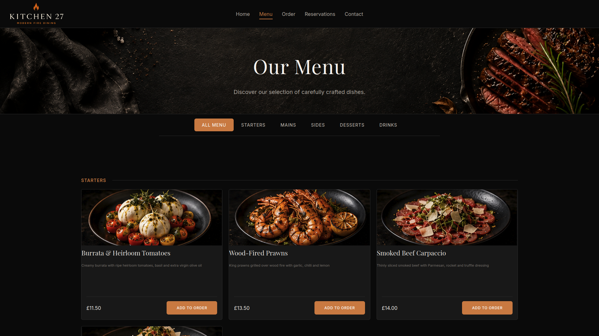
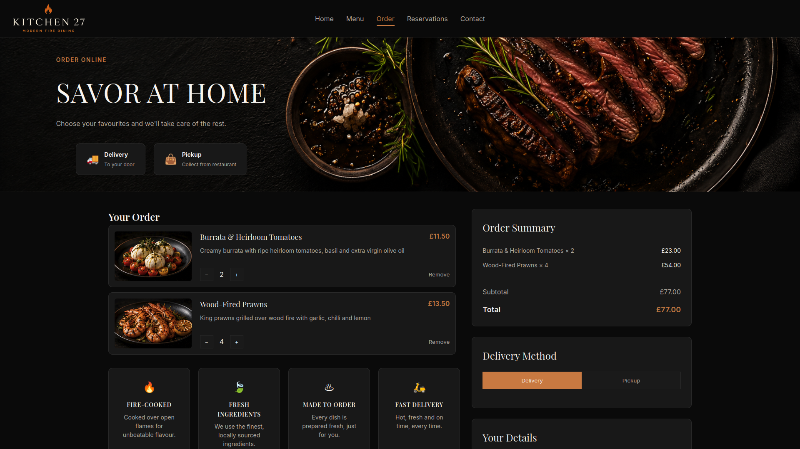
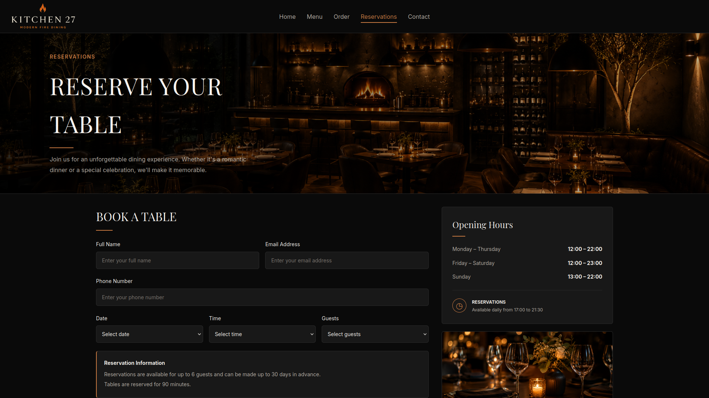

# Kitchen 27 — Restaurant Booking System

A full-stack restaurant booking and ordering system built with React and Django REST Framework.

## Live Demo

🌐 **[View the Live Website](https://restraunt-website-neon.vercel.app/)**

## Overview

Kitchen 27 is a full-stack restaurant web application designed to provide customers with an online menu, food ordering and table reservation system, alongside a staff dashboard for managing the restaurant.

The project demonstrates full-stack development, REST API integration, authentication, role-based access control, database management, cloud storage and deployment.

## Features

### Customer Features

- Browse the restaurant menu
- Filter menu items by category
- View item descriptions, prices and availability
- Place food orders
- Choose between pickup and delivery
- Choose between card and cash payment
- Make table reservations
- Receive order and reservation confirmation through the application's email system
- Responsive design for desktop and mobile devices

### Staff Dashboard

- Staff authentication
- Role-based access control
- View and manage orders
- Update order statuses
- View and manage reservations
- Update reservation statuses
- Manage menu items
- Add, edit and delete menu items
- Upload menu images
- Manage restaurant tables
- Manage staff accounts
- Transfer administrator privileges

## Screenshots

### Homepage


### Menu



### Ordering



### Reservations



### Staff Dashboard


## Tech Stack

### Frontend

- React
- JavaScript
- React Router
- HTML
- CSS
- Vite

### Backend

- Python
- Django
- Django REST Framework
- Token Authentication

### Database

- PostgreSQL
- Neon

### Cloud & Deployment

- Vercel — Frontend hosting
- Render — Backend hosting
- Cloudinary — Image storage

### Development Tools

- Git
- GitHub
- VS Code

## Architecture

```text
                        ┌──────────────────┐
                        │      Vercel      │
                        │ React Frontend   │
                        └────────┬─────────┘
                                 │
                              REST API
                                 │
                                 ▼
                        ┌──────────────────┐
                        │     Render       │
                        │ Django Backend   │
                        └───────┬──────────┘
                                │
                    ┌───────────┴───────────┐
                    │                       │
                    ▼                       ▼
             ┌──────────────┐       ┌──────────────┐
             │     Neon     │       │  Cloudinary  │
             │  PostgreSQL  │       │    Images    │
             └──────────────┘       └──────────────┘
